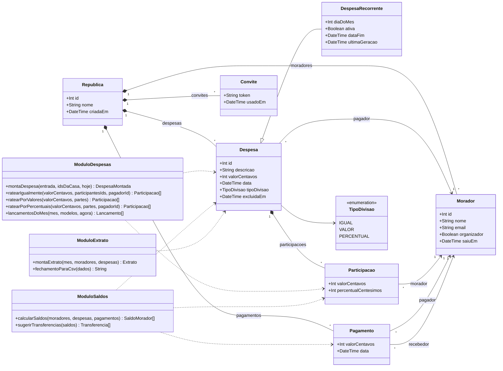
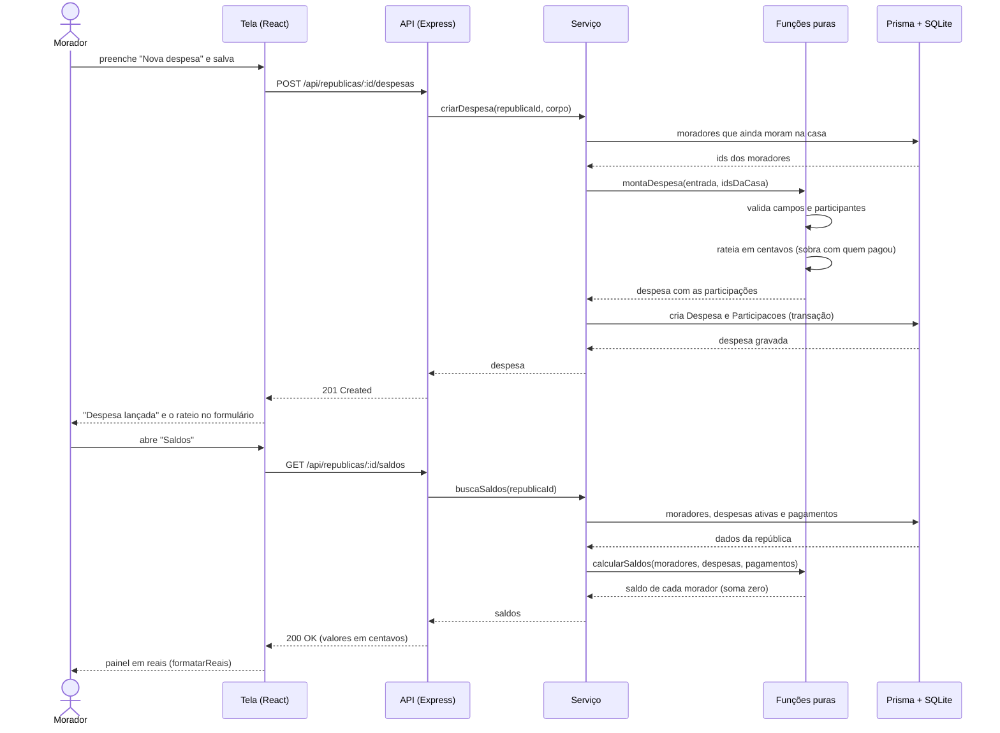

# Divide Aí

Sistema de gestão de despesas compartilhadas para pessoas que dividem moradia.

## Objetivo

Quem divide apartamento acaba controlando as contas da casa em grupos de
WhatsApp e planilhas improvisadas, onde é fácil perder um lançamento e difícil
saber quem está devendo quanto. O Divide Aí centraliza as despesas de uma
república: cada conta é registrada com quem pagou e entre quem deve ser
dividida — porque nem toda despesa é rateada por todos — e o sistema mantém o
saldo de cada morador atualizado, mostrando quanto cada um deve e a quem.
Também trata contas recorrentes, como aluguel e internet, que hoje precisam
ser relançadas manualmente todo mês.

## Equipe

| Nome completo | Papel |
|---|---|
| Igor Rodrigues da Silva Machado | Fullstack |
| Thalita Fernandes Pires | Fullstack |
| Eduardo Soares Peluffo | Backend |
| Lucas Araujo Pinto Resende | Backend |

## Tecnologias

- **Frontend:** React 18 + TypeScript, Vite, React Router
- **Backend:** Node.js + Express + TypeScript, API REST
- **Banco de dados:** SQLite + ORM Prisma
- **Agentes de IA:** Claude Code e Claude (Cowork), da Anthropic; Antigravity, do Google

Justificativa: adotamos uma linguagem única (TypeScript) em todo o stack, para
que todos os membros consigam atuar e revisar tanto backend quanto frontend,
conforme exigido no enunciado. React e Node.js são as tecnologias web mais
utilizadas do mercado (44,7% e 48,7% — Stack Overflow Developer Survey 2025).

O projeto começa em SQLite para eliminar atrito de instalação e garantir que os
quatro membros consigam executá-lo desde o primeiro dia. A migração para
PostgreSQL (banco mais utilizado do mercado, 55,6% na mesma pesquisa), com
Docker Compose, estava prevista, mas ficou fora do TP1: o time priorizou as
histórias. Como todo o acesso a dados passa pelo ORM Prisma, ela se restringe
ao provider, à string de conexão e ao adaptador do banco (em `src/db.ts` e
`prisma/seed.ts`); as consultas não mudam.

## Como rodar localmente

```bash
git clone https://github.com/igorrsm/divide-ai.git
cd divide-ai
echo 'DATABASE_URL="file:./dev.db"' > .env
npm install
npx prisma migrate dev      # cria o arquivo do banco e as tabelas
npx prisma generate         # gera o cliente do Prisma em src/generated/
npx prisma db seed          # República Demo: Ana (organizadora), Bruno e Carla
npm run dev                 # API na porta 3000 e tela em http://localhost:5173
```

Pré-requisito: Node.js 24, conforme o `.nvmrc` (com o nvm, rode `nvm install` na pasta do projeto).
No Windows, crie o `.env` pelo editor: no PowerShell, o `echo` grava em UTF-16.

O seed apaga e recria os dados, então pode ser rodado de novo para voltar ao estado
inicial. `npm test` roda os testes e `npm run lint` o ESLint.

## Histórias de usuário

1. Como morador, quero criar uma república e convidar colegas por e-mail, para
   que todos enxerguem as mesmas contas.
2. Como morador, quero cadastrar uma despesa informando valor, data, categoria
   e quem pagou, para registrar um gasto da casa.
3. Como morador, quero escolher quais moradores participam de cada despesa,
   porque nem toda conta é dividida por todos.
4. Como morador, quero dividir uma despesa em partes iguais ou por
   valores/percentuais customizados, para refletir acordos diferentes.
5. Como morador, quero ver meu saldo consolidado — quanto devo e quanto tenho
   a receber — para saber minha situação sem precisar fazer contas.
6. Como morador, quero registrar um acerto de pagamento com outro morador,
   para que os saldos sejam atualizados.
7. Como morador, quero cadastrar despesas recorrentes (aluguel, internet),
   para que sejam lançadas automaticamente todo mês.
8. Como morador, quero ver o extrato do mês, com o total da casa e o total por
   pessoa, para conferir e fechar o mês.

### Possível extensão
Simplificação de dívidas: em vez de A→B, B→C e C→A, o sistema calcula o menor
número de transferências que zera todos os saldos.

### Situação das histórias ao fim do TP1

As histórias acima são as do início do trabalho. No backlog (Notion), cada uma virou
um ou mais cartões, com código e critérios de aceitação. Todos estão mesclados na
`main`.

| História | Cartões (PR) | O que mudou em relação ao texto original |
|---|---|---|
| 1. Criar república e convidar | A1 (#49), A2 (#52), A3 (#23), A4 (#61), A5 (#62) | O convite é por link de uso único, sem envio de e-mail. Sem login: "Quem é você?" escolhe o morador |
| 2. Cadastrar despesa | B1 (#15), B3 (#36), B6 (#40), E2 (#44) | **Sem categoria**: ficou fora do escopo. Há lista com filtros, edição e exclusão |
| 3. Escolher quem participa | B4 (#37) | — |
| 4. Dividir igual, por valores ou percentuais | B2 (#34), B5 (#47) | — |
| 5. Ver o saldo consolidado | D1 (#25), D2 (#31) | — |
| 6. Registrar acerto | D3 (#51) | — |
| 7. Despesas recorrentes | C1 (#53), C2 (#60) | Os lançamentos do mês são gerados por um botão, não automaticamente (sem agendador) |
| 8. Extrato do mês | E1 (#42), E3 (#63) | Também exporta o fechamento em CSV |
| Extensão: simplificar dívidas | D5 (#59) | Sugestão gulosa; não promete o mínimo absoluto de transferências |

## Documentação (UML)

### Diagrama de classes

As classes de domínio são as tabelas de `prisma/schema.prisma`. O backend não tem
classes de serviço: as regras são funções puras agrupadas por pasta, que aparecem aqui
como os módulos `ModuloDespesas` (`src/despesas`), `ModuloSaldos` (`src/saldos`) e
`ModuloExtrato` (`src/extrato`). Eles só leem as entidades, por isso a ligação é de
dependência. Dinheiro é sempre `Int` em centavos, e o saldo não é guardado: é
calculado a cada consulta.



`DespesaRecorrente` herda de `Despesa` (tabela por subclasse: o `id` é chave primária e
estrangeira ao mesmo tempo). A soma das participações de uma despesa é igual ao valor
dela: a sobra do arredondamento fica com quem pagou ou, se ele não participa, com o
participante de menor id.

### Diagrama de sequência: lançar uma despesa e ver o saldo

O caso de uso central do sistema. A tela fala com a API pelo proxy do Vite; a rota
chama o serviço, que busca os dados com o Prisma e entrega a conta às funções puras.



## Convenções de desenvolvimento

- Commits seguindo Conventional Commits (`feat:`, `fix:`, `docs:`, `refactor:`)
- Máximo de 100 linhas por commit; exceções justificadas na mensagem do commit
- Nenhum push direto na `main` — toda mudança entra por Pull Request revisado
- Todo código gerado por IA é revisado e compreendido por ao menos um membro
  antes do merge
